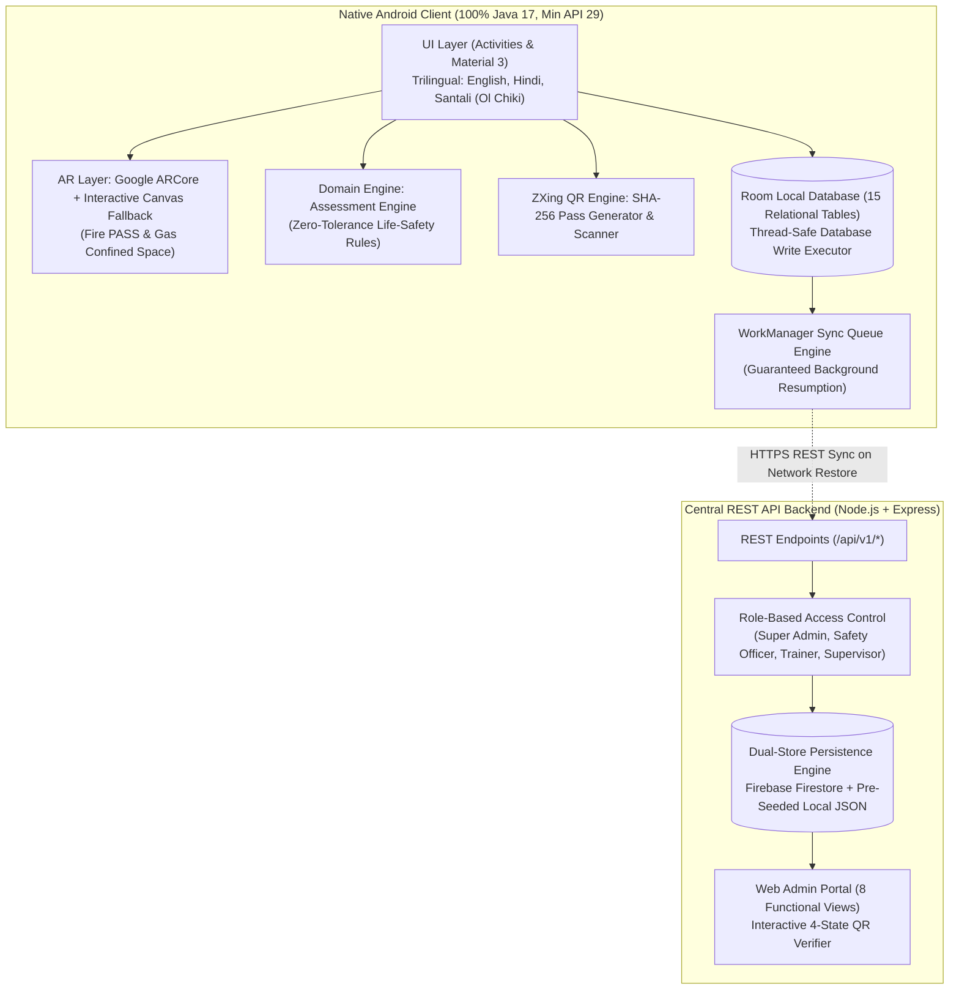

# SafetyAR Technical Architecture Dossier
**Smart India Hackathon (SIH) 2026 | Government of Jharkhand & DGMS Compliance**

SafetyAR is an offline-first, native Android industrial AR vocational safety training, assessment, and digital certification platform engineered strictly in **100% Native Java 17** (Zero Kotlin) for high-risk industrial workers in Jharkhand:
- **Coal Mining**: Bharat Coking Coal Limited (BCCL), Dhanbad
- **Steel & Metallurgy**: Tata Steel Limited, Jamshedpur
- **Mica Processing**: Jharkhand State Mineral Development Corporation (JSMDC), Koderma

---

## 1. High-Level System Architecture

---

## 2. Offline-First Architecture & Synchronization Pipeline

The offline-first paradigm is a mandatory requirement under Section 14. Industrial workers underground in Moonidih Seam XVI operate in environments with zero cellular or Wi-Fi signal.

### Local-First Persistence Strategy:
1. **Zero Network Requirement for Core Workflows**:
   - Worker login using cached pre-seeded credentials (`WRK-JH-COAL-0891`, `WRK-JH-STEEL-1045`, etc.).
   - Full 11-step microlearning module progression.
   - Real-time interactive AR simulation (spatial hazard identification, PASS extinguisher protocol, SCBA permit verification).
   - Assessment scoring and zero-tolerance safety rule evaluations.
   - Immediate generation of digital certificates with scannable SHA-256 QR codes.
   - Offline supervisor camera verification against local Room registry.
2. **WorkManager Sync Queue**:
   - Whenever an assessment completes or certificate is generated offline, a `SyncQueueEntity` record is inserted with `status = 'PENDING'`.
   - `DataSyncWorker` is registered with network constraints (`NetworkType.CONNECTED`).
   - As soon as the worker reaches surface Wi-Fi or cellular connectivity, WorkManager automatically drains the queue to `POST /api/v1/sync/upload`.
   - The UI displays live synchronization status badges:
     - `Synced` (Green check)
     - `Pending Sync` (Amber clock with record count)
     - `Sync Failed` (Red alert with manual retry button)

---

## 3. Relational Room Database Schema (15 Tables)

The Room Database (`safetyar_industrial.db`, version 5) contains 15 relational tables matching Section 15:

| Table Name | Primary Key | Purpose |
| :--- | :--- | :--- |
| `workers` | `workerId` | Worker profile, trade, sector, active flag, orientation day |
| `organizations` | `orgId` | Enterprise headquarters, DGMS zonal directorate |
| `training_modules` | `moduleId` | Title, DGMS standard code, duration, pass threshold |
| `training_lessons` | `lessonId` | Microlearning steps, theory, key safety takeaways |
| `ar_scenarios` | `scenarioId` | Sector simulation setup, spatial hazard coordinate list |
| `questions` | `questionId` | Assessment question text, explanation, point score |
| `question_options` | `optionId` | Multiple-choice options with boolean isCorrect |
| `assessment_attempts`| `attemptId` | Individual worker assessment session header |
| `assessment_records` | `assessmentId`| Score, hazards neutralized, critical mistakes, timestamp |
| `answers` | `answerId` | Worker selected response per question |
| `training_progress` | `progressId` | 11-step progress tracker (`currentStep`, `completed`) |
| `certificates` | `certificateId`| Digital pass (`SAFETYAR-JH-2026-XXXXXX`), validity, QR token |
| `sync_queue` | `syncId` | Unsent payloads, retry counter, sync status |
| `training_assignments`| `assignmentId`| Module dispatch by supervisor, due dates, priority |
| `orientation_progress`| `orientationId`| 30-day statutory onboarding progress and completed days |

---

## 4. Google ARCore + Graceful Interactive Fallback

SafetyAR operates on both high-end ARCore-certified devices and budget smartphones commonly issued to industrial workers:

1. **Hardware Handshake**:
   - `ArCoreApk.getInstance().checkAvailability(...)` queries Google Play Services for AR.
2. **ARCore Mode**:
   - Surface plane detection, 6-DoF spatial tracking, anchor attachment for fire sources, toxic plumes, and SCBA PPE stations.
3. **Interactive Simulation Fallback**:
   - If ARCore is unsupported or camera permissions are restricted, the application immediately activates CameraX with an interactive Canvas simulation engine.
   - Displays prominent notice: *"AR is not supported on this device. You can continue using Interactive Safety Simulation."*
   - Never crashes or closes abruptly.

---

## 5. Assessment Engine & Zero-Tolerance Life-Safety Rule

The assessment engine (`AssessmentEngine.java`) enforces Section 11:
- Configurable pass threshold (Default 70%, Strict 80%).
- **Zero-Tolerance Fatal Mistake Policy**:
  - Questions tagged with `isSafetyCritical = true` (e.g. entering a confined space without atmospheric gas testing or deploying water on energized electrical equipment).
  - Even if the worker scores 90%, committing **any** critical safety violation results in **immediate failure** (`isPassed() == false`, `isFailedDueToCriticalMistake() == true`).
- Comprehensive weak area diagnostics pinpoint exact DGMS circular guidelines for remediation.

---

## 6. Cryptographic Certificate & QR Verification Service

Certificates follow statutory standards:
- Unique ID Format: `SAFETYAR-JH-2026-XXXXXX`
- Cryptographic Token: `SHA-256(certId | workerId | org | module | score | issuedAt | expiresAt | salt)`
- 4 Verification States:
  1. `VALID`: Active certificate, within validity window, green theme (`#10B981`).
  2. `EXPIRED`: Past expiration date, amber theme (`#F59E0B`), recertification required.
  3. `REVOKED`: Suspended by Safety Officer for safety infractions, red theme (`#EF4444`).
  4. `NOT FOUND`: Unregistered ID or altered token, counterfeit alert (`#DC2626`).

---

## 7. Trilingual Localization Architecture

- **English**: `res/values/strings.xml`
- **Hindi (हिंदी)**: `res/values-hi/strings.xml`
- **Santali (Ol Chiki - ᱥᱟᱱᱛᱟᱲᱤ)**: `res/values-sat/strings.xml`
- Dynamic in-app language switching via `LocaleHelper.java` without requiring device reboot.
